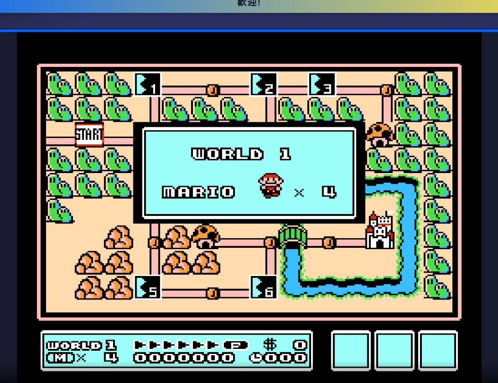

# Emulator_Ben: My Retro Game Hub
Why I Built This
I created Emulator_Ben out of a passion for retro games. When my favorite online platform for these classics shut down, I saw an opportunity to build my own solution and ensure I could always access the games I love. This project is a way for me to preserve that nostalgic gaming experience.
[Play Here!](https://benp1236691.github.io/Emulator_Ben/)

# How It's Made
This emulator is built using the EmulatorJS framework. This powerful framework provided the tools I needed to bring my vision to life and create a functional platform for playing retro titles. I also made a CSS file for fun.

# Results

# What's Next
This project is still a work in progress! My main goal is to add more games to the library, expanding the collection and making Emulator_Ben an even richer resource for retro gaming enthusiasts.
